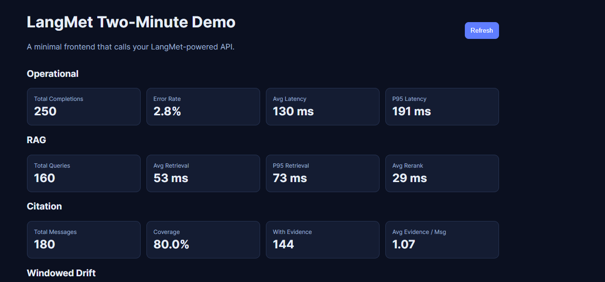
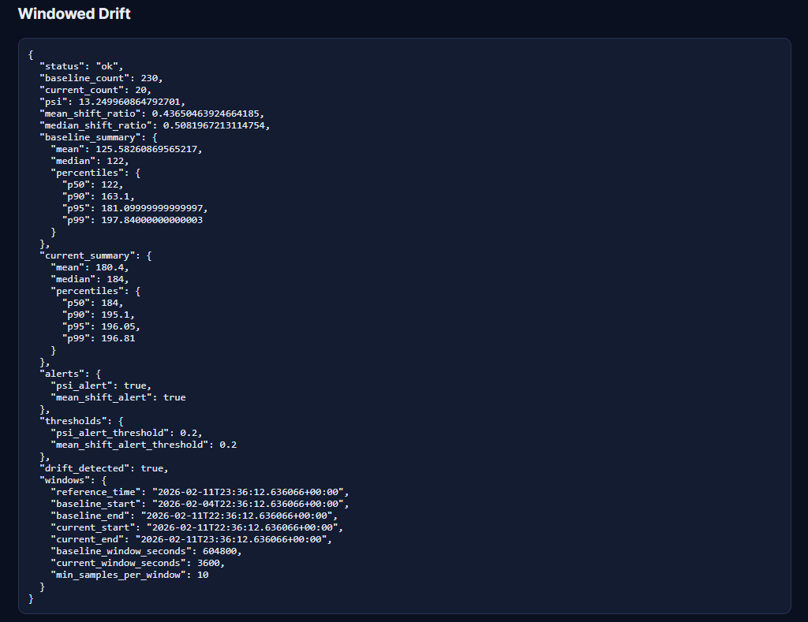

# LangMet Two-Minute Demo


This demo gives engineers a fast "can I see it working?" experience:

- tiny FastAPI backend
- simple frontend (no build tools)
- live calls to LangMet analytics and drift APIs

## Run in ~2 minutes

From the repository root:

```bash
python -m pip install -e ".[fastapi]"
python -m pip install uvicorn
uvicorn app:app --app-dir examples/two-minute-demo --reload
```

Open:

- `http://127.0.0.1:8000/` -> demo UI
- `http://127.0.0.1:8000/api/metrics` -> metrics JSON
- `http://127.0.0.1:8000/api/drift` -> windowed drift JSON

## What this demonstrates

- `compute_operational_metrics(...)`
- `compute_rag_metrics(...)`
- `compute_citation_coverage(...)`
- `detect_numeric_drift_windowed(...)`




